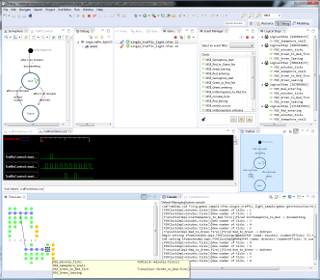

<!-- Page Heading/Breadcrumbs -->

    

        <h1 class="page-header">GEMOC Component Discovery Catalog
        </h1>
        <ol class="breadcrumb">
            <li><a href="{{ site.baseurl }}/">Home</a>
            </li>
            <li class="active">Discovery Catalog</li>
        </ol>
    

<!-- /.row -->

Categories:
- [GEMOC Language](#gemoc-language)
- [GEMOC Coordination](#gemoc-coordination)
- [Alternative GEMOC based Engines](#alternativegemoc-based-engines)
- [Exhaustive Exploration](#exhaustive-exploration)
- [Modeler](#modeler)
- [Alternative Tools](#alternative-tools)

All these components can be installed from a GEMOC Studio. Simply click on <i>Help &gt; Install Additional GEMOC Components</i>

## GEMOC Language
Languages designed using GEMOC.

<!-- ActivityDiagram Languages (Sequential/Concurrent)(Incubation)  -->

    
    
    	
        <h3>
         ActivityDiagram Languages (Sequential/Concurrent)(Incubation) <small>by GEMOC</small></h3>
        
Deployer that installs the project sources for Concurrent and/or Sequential version of the Activitydiagram Language and sample models.

        
Deployer that installs the project sources for two versions of the Activitydiagram Language developped using GEMOC. One version will run using the GEMOC Sequential engine, the second using Concurrent engine.  The deployer also provides sample models.
        <a href="http://github.com/gemoc/activitydiagram">Learn more</a>

        <h4>Update site</h4>
        <ul>
            <li><a href="https://ci.inria.fr/gemoc/job/ActivityDiagram_updatesite/lastSuccessfulBuild/artifact/dev/releng/org.gemoc.activitydiagram.repository/target/repository/">https://ci.inria.fr/gemoc/job/ActivityDiagram_updatesite/lastSuccessfulBuild/artifact/dev/releng/org.gemoc.activitydiagram.repository/target/repository/</a></li>            
        </ul>
    

    

                
    

<!-- ArduinoModeling Languages (Sequential/Concurrent)(Incubation)  -->

    
    
    	
        <h3>
         ArduinoModeling Languages (Sequential/Concurrent)(Incubation) <small>by GEMOC</small></h3>
        
Deployer that installs the project sources for Sequential and Concurrent  versions of the ArduinoModeling Language and sample models.

        
Deployer that installs the project sources for two versions of the ArduinoModeling Language developped using GEMOC.  One version run using the GEMOC Sequential engine, the second using the Concurrent engine. The deployer also provides some sample models.
        <a href="http://github.com/gemoc/arduinomodeling">Learn more</a>

        <h4>Update site</h4>
        <ul>
            <li><a href="https://ci.inria.fr/gemoc/job/ArduinoModeling_updatesite/lastSuccessfulBuild/artifact/dev/releng/org.gemoc.arduinomodeling.repository/target/repository/">https://ci.inria.fr/gemoc/job/ArduinoModeling_updatesite/lastSuccessfulBuild/artifact/dev/releng/org.gemoc.arduinomodeling.repository/target/repository/</a></li>            
        </ul>
    

    

                
    

<!-- Markedgraph Language (Concurrent)(Incubation)  -->

    
    
    	
        <h3>
         Markedgraph Language (Concurrent)(Incubation) <small>by GEMOC</small></h3>
        
Deployer that installs the project sources for the concurrent version of the Markedgraph Language and sample models.

        
Deployer that installs the project sources for the Markedgraph Language developped using GEMOC.  This version runs using the GEMOC Concurrent engine. The deployer also provides some sample models. This is the result of the GEMOC tutorial available in the eclipse help.
        <a href="http://gemoc.github.io/gemoc-studio/publish/tutorial_markedgraph/html_single/GuideTutorialMarkedGraph.html">Learn more</a>

        <h4>Update site</h4>
        <ul>
            <li><a href="https://ci.inria.fr/gemoc/job/Markedgraph_updatesite/lastSuccessfulBuild/artifact/sample/markedgraph/releng/org.gemoc.sample.markedgraph.repository/target/repository/">https://ci.inria.fr/gemoc/job/Markedgraph_updatesite/lastSuccessfulBuild/artifact/sample/markedgraph/releng/org.gemoc.sample.markedgraph.repository/target/repository/</a></li>            
        </ul>
    

    

                
    

## GEMOC Coordination
Language coordination operators designed using GEMOC.

<!-- Operator for TFSM and ActivityDiagram (Incubation)  -->

    
    
    	
        <h3>
         Operator for TFSM and ActivityDiagram (Incubation) <small>by I3S</small></h3>
        
Deployer that installs the project sources for the coordination operator for TFSM and ActivityDiagram concurrent languages and sample models.

        
Deployer that installs the project sources for the coordination operator for TFSM and ActivityDiagram concurrent languages developped using GEMOC. The deployer also provides some sample models.
        <a href="http://timesquare.inria.fr/BCOoL/">Learn more</a>

        <h4>Update site</h4>
        <ul>
            <li><a href="https://ci.inria.fr/gemoc/job/gemoc-studio_official_samples_deployer/lastSuccessfulBuild/artifact/official_samples/sample.deployers/releng/org.gemoc.official_samples.deployers.repository/target/repository/">https://ci.inria.fr/gemoc/job/gemoc-studio_official_samples_deployer/lastSuccessfulBuild/artifact/official_samples/sample.deployers/releng/org.gemoc.official_samples.deployers.repository/target/repository/</a></li>            
        </ul>
    

    

                
    

## Alternative GEMOC based Engines
Engines and tools proposing alternative approaches (based on GEMOC execution framework)
<!-- GEMOC Concurrent Engine  -->

    
    
    	
        <h3>
         GEMOC Concurrent Engine <small>by GEMOC</small></h3>
        
This concurrent engine allows you to define the execution semantics of your language and specifying concurrency using TimeSquare.

        
This component provides the editors and execution engine, as well as wizards helping you to setup your concurrent language projects.
        <a href="https://github.com/gemoc/concurrency">Learn more</a>

        <h4>Update site</h4>
        <ul>
            <li><a href="https://ci.inria.fr/gemoc/view/All/job/gemoc-studio-eclipsefork/job/concurrency-coordination/lastSuccessfulBuild/artifact/gemoc-studio-concurrency/ccsljava_execution/releng/org.eclipse.gemoc.execution.concurrent.ccsljava.repository/target/repository/">https://ci.inria.fr/gemoc/view/All/job/gemoc-studio-eclipsefork/job/concurrency-coordination/lastSuccessfulBuild/artifact/gemoc-studio-concurrency/ccsljava_execution/releng/org.eclipse.gemoc.execution.concurrent.ccsljava.repository/target/repository/</a></li>  
            <li><a href="https://ci.inria.fr/gemoc/view/All/job/gemoc-studio-eclipsefork/job/concurrency-coordination/lastSuccessfulBuild/artifact/gemoc-studio-concurrency/moccml/mapping/deployment/org.eclipse.gemoc.moccml.mapping.updatesite/target/repository/">https://ci.inria.fr/gemoc/view/All/job/gemoc-studio-eclipsefork/job/concurrency-coordination/lastSuccessfulBuild/artifact/gemoc-studio-concurrency/moccml/mapping/deployment/org.eclipse.gemoc.moccml.mapping.updatesite/target/repository/</a></li>      
	    <li><a href="https://ci.inria.fr/gemoc/view/All/job/gemoc-studio-eclipsefork/job/concurrency-coordination/lastSuccessfulBuild/artifact/gemoc-studio-concurrency/moccml/constraint/releng/org.eclipse.gemoc.mocc.p2updatesite/target/repository/">https://ci.inria.fr/gemoc/view/All/job/gemoc-studio-eclipsefork/job/concurrency-coordination/lastSuccessfulBuild/artifact/gemoc-studio-concurrency/moccml/constraint/releng/org.eclipse.gemoc.mocc.p2updatesite/target/repository/</a></li>     
            <li><a href="http://timesquare.inria.fr/update_site/oxygen">http://timesquare.inria.fr/update_site/oxygen</a></li>
        </ul>
    

    

                
    

<!-- GEMOC xMOF Engine  -->

    
    
    	
        <h3>
         GEMOC xMOF Engine <small>by Vienna University of Technology</small></h3>
        
xMOF allows you to define the execution semantics of your language with UML activity diagrams.

        
The xMOF language allows you to define the execution semantics of your language with UML activity diagrams. This component provides the xMOF language, editor and execution engine, as well as wizards helping you to setup your xMOF projects.
        <a href="https://github.com/moliz/moliz.xmof">Learn more</a>

        <h4>Update site</h4>
        <ul>
            <li><a href="http://moliz.github.io/moliz.gemoc/updatesite/nightly/">http://moliz.github.io/moliz.gemoc/updatesite/nightly/</a></li>            
        </ul>
    

    

                
    

<!-- ALE Engine -->

    
    
    	
        <h3>
          ALE Engine<small>by Inria and Obeo</small></h3>
        
This engine allows to define the execution semantics of languages with Action Language for EMF (ALE).

        
Ale is a language to define behaviors on the top of Ecore models. It is intended to be distributed in EcoreTools and will be an alternative to K3. It has its own GEMOC engine support.
        <a href="http://gemoc.org/ale-lang/">Learn more</a>

        <h4>Update site</h4>
        <ul>
            <li><a href="https://ci.inria.fr/gemoc/job/ale-lang/lastSuccessfulBuild/artifact/releng/org.eclipse.emf.ecoretools.ale.updatesite/target/repository/">https://ci.inria.fr/gemoc/job/ale-lang/lastSuccessfulBuild/artifact/releng/org.eclipse.emf.ecoretools.ale.updatesite/target/repository/</a></li> 
            <li><a href="https://ci.inria.fr/gemoc/job/gemoc-studio-ale-execution/lastSuccessfulBuild/artifact/releng/org.eclipse.gemoc.ale.engine.updatesite/target/repository/</a></li>           
        </ul>
    

    

        <!--  -->        
    

## Exhaustive Exploration
Tools for Exhaustive Exploration.

<!-- Clocksystem  -->

    
    
    	
        <h3>
         Clocksystem <small>by ENSTA</small></h3>
        
Multiform Time Constraints.

        
Clocksystem is meta-described clock-constraint engine, which embeds a formal model of logical time into the Smalltalk general-purpose language and environment.

        
        <h4>Update site</h4>
        <ul>
            <li><a href="https://ci.inria.fr/gemoc/job/concurrency_exploration/lastSuccessfulBuild/artifact/exploration/releng/org.gemoc.mocc.clocksystem.features.updatesite/target/repository">https://ci.inria.fr/gemoc/job/concurrency_exploration/lastSuccessfulBuild/artifact/exploration/releng/org.gemoc.mocc.clocksystem.features.updatesite/target/repository</a></li>
        </ul>
    

    

        
    

## Modeler
Modeling environment tools.

<!-- UML Designer  -->

    
    
    	
        <h3>
         UML Designer <small>by Obeo</small></h3>
        
Graphical tooling to edit and visualize UML models.

        
UML Designer provides a set of common diagrams to work with UML 2.5 models. The intent is to provide an easy way to make the transition from UML to domain specific modeling. This way users can continue to manipulate legacy UML models and start working with DSL. Users can even re-use the provided representations and work in a total transparence on both UML and DSL models at the same time.
        <a href="http://www.umldesigner.org/">Learn more</a>

        <h4>Update site</h4>
        <ul>
            <li><a href="http://download.eclipse.org/releases/luna/201502271000">http://download.eclipse.org/releases/luna/201502271000</a></li>
            <li><a href="http://download.eclipse.org/sirius/updates/nightly/3.0.x/luna<">http://download.eclipse.org/sirius/updates/nightly/3.0.x/luna</a></li>
            <li><a href="http://releases.umldesigner.org/5.0.1/repository/">http://releases.umldesigner.org/5.0.1/repository/</a></li>
        </ul>
    

    

        
    

## Alternative Tools
Engines and tools proposing alternative approaches (may not directly use GEMOC execution framework)

<!-- TESL Engine and Editor  -->

    
    
    	
        <h3>TESL Engine and Editor <small>by CentraleSup&#xe9;lec/LRI</small></h3>
        
The Tagged Event Specification Language allows the specification of timed systems by modeling events as clocks and occurrences of an event as ticks on its clock.

        
The Tagged Event Specification Language allows the specification of timed systems by modeling events as clocks and occurrences of an event as ticks on its clock.
        <a href="http://wwwdi.supelec.fr/software/TESL/">Learn more</a>

        <h4>Update site</h4>
        <ul>
            <li><a href="http://wwwdi.supelec.fr/tesl-update-site">http://wwwdi.supelec.fr/tesl-update-site</a></li>            
        </ul>
    

    

                
    

