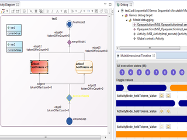
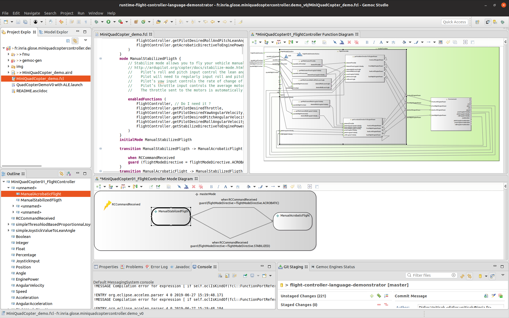
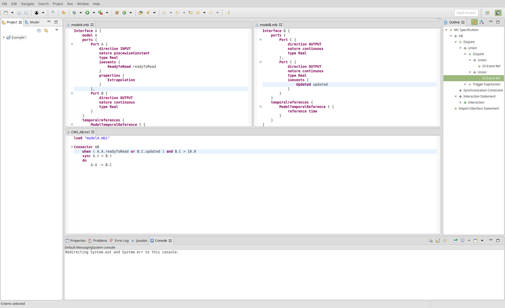
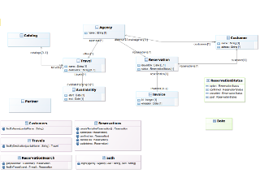
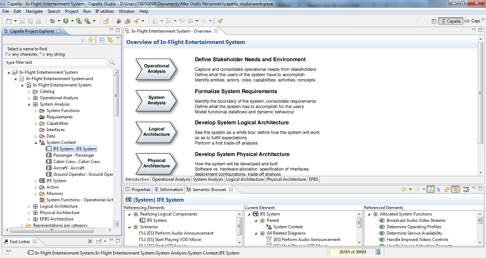
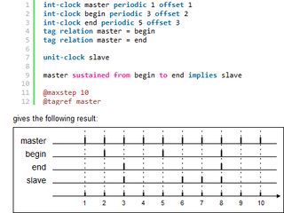

<!-- Page Heading/Breadcrumbs -->

    

        <h1 class="page-header">GEMOC Component Discovery Catalog
        </h1>
        <ol class="breadcrumb">
            <li><a href="{{ site.baseurl }}/">Home</a>
            </li>
            <li class="active">Discovery Catalog</li>
        </ol>
    

<!-- /.row -->

Categories:
- [GEMOC Language](#gemoc-language)
- [GEMOC Coordination](#gemoc-coordination)
- [GEMOC Engine extensions](#gemoc-engine-extensions)
- [Alternative GEMOC based Engines](#alternativegemoc-based-engines)
- [Exhaustive Exploration](#exhaustive-exploration)
- [Modeler](#modeler)
- [Alternative Tools](#alternative-tools)

All these components can be installed from a GEMOC Studio. Simply click on <i>Help &gt; Install Additional GEMOC Components</i>

## GEMOC Language
Languages designed using GEMOC.

<!-- ActivityDiagram Languages (Sequential/Concurrent)(Incubation)  -->

    
    
    	
        <h3>
         ActivityDiagram Languages (Sequential/Concurrent)(Incubation) <small>by GEMOC</small></h3>
        
Deployer that installs the project sources for Concurrent and/or Sequential version of the Activitydiagram Language and sample models.

        
Deployer that installs the project sources for two versions of the Activitydiagram Language developped using GEMOC. One version will run using the GEMOC Sequential engine, the second using Concurrent engine.  The deployer also provides sample models.
        <a href="http://github.com/gemoc/activitydiagram">Learn more</a>

        <h4>Update site</h4>
        <ul>
            <li><a href="https://ci.inria.fr/gemoc/job/ActivityDiagram_updatesite/lastSuccessfulBuild/artifact/dev/releng/org.gemoc.activitydiagram.repository/target/repository/">https://ci.inria.fr/gemoc/job/ActivityDiagram_updatesite/lastSuccessfulBuild/artifact/dev/releng/org.gemoc.activitydiagram.repository/target/repository/</a></li>            
        </ul>
    

    

                
    

<!-- ArduinoModeling Languages (Sequential/Concurrent)(Incubation)  -->

    
    
    	
        <h3>
         ArduinoModeling Languages (Sequential/Concurrent)(Incubation) <small>by GEMOC</small></h3>
        
Deployer that installs the project sources for Sequential and Concurrent  versions of the ArduinoModeling Language and sample models.

        
Deployer that installs the project sources for two versions of the ArduinoModeling Language developped using GEMOC.  One version run using the GEMOC Sequential engine, the second using the Concurrent engine. The deployer also provides some sample models.
        <a href="http://github.com/gemoc/arduinomodeling">Learn more</a>

        <h4>Update site</h4>
        <ul>
            <li><a href="https://ci.inria.fr/gemoc/job/ArduinoModeling_updatesite/lastSuccessfulBuild/artifact/dev/releng/org.gemoc.arduinomodeling.repository/target/repository/">https://ci.inria.fr/gemoc/job/ArduinoModeling_updatesite/lastSuccessfulBuild/artifact/dev/releng/org.gemoc.arduinomodeling.repository/target/repository/</a></li>            
        </ul>
    

    

                
    

<!-- Markedgraph Language (Concurrent)(Incubation)  -->

    
    
    	
        <h3>
         Markedgraph Language (Concurrent)(Incubation) <small>by GEMOC</small></h3>
        
Deployer that installs the project sources for the concurrent version of the Markedgraph Language and sample models.

        
Deployer that installs the project sources for the Markedgraph Language developped using GEMOC.  This version runs using the GEMOC Concurrent engine. The deployer also provides some sample models. This is the result of the GEMOC tutorial available in the eclipse help.
        <a href="http://gemoc.github.io/gemoc-studio/publish/tutorial_markedgraph/html_single/GuideTutorialMarkedGraph.html">Learn more</a>

        <h4>Update site</h4>
        <ul>
            <li><a href="https://ci.inria.fr/gemoc/job/Markedgraph_updatesite/lastSuccessfulBuild/artifact/sample/markedgraph/releng/org.gemoc.sample.markedgraph.repository/target/repository/">https://ci.inria.fr/gemoc/job/Markedgraph_updatesite/lastSuccessfulBuild/artifact/sample/markedgraph/releng/org.gemoc.sample.markedgraph.repository/target/repository/</a></li>            
        </ul>
    

    

                
    

<!-- Flight Controller Language (ALE)(Incubation)  -->

    
    
    	
        <h3>
         Flight Controller Language (ALE)(Incubation) <small>by Inria</small></h3>
        
Fligth Controller Language (FCL) for drone written using GEMOC and ALE and sample models. [gemoc-studio 3.1.0]

        
The Fligth Controller Language is a demonstration language to illustrate GEMOC capabilities. Thanks to a control flow + mode state machine semantics, it allows to specify the behavior of a drone flight controller and simulate it.
        <a href="https://glose.gitlabpages.inria.fr/flight-controller-language-demonstrator/">Learn more</a>

        <h4>Update site</h4>
        <ul>
            <li><a href="https://glose.gitlabpages.inria.fr/flight-controller-language-demonstrator/updatesite/latest/">https://glose.gitlabpages.inria.fr/flight-controller-language-demonstrator/updatesite/latest/</a></li>            
        </ul>
    

    

                
    

## GEMOC Coordination
Language coordination operators designed using GEMOC.

<!-- Operator for TFSM and ActivityDiagram (Incubation)  -->

    
    
    	
        <h3>
         Operator for TFSM and ActivityDiagram (Incubation) <small>by I3S</small></h3>
        
Deployer that installs the project sources for the coordination operator for TFSM and ActivityDiagram concurrent languages and sample models.

        
Deployer that installs the project sources for the coordination operator for TFSM and ActivityDiagram concurrent languages developped using GEMOC. The deployer also provides some sample models.
        <a href="http://timesquare.inria.fr/BCOoL/">Learn more</a>

        <h4>Update site</h4>
        <ul>
            <li><a href="https://ci.inria.fr/gemoc/job/gemoc-studio_official_samples_deployer/lastSuccessfulBuild/artifact/official_samples/sample.deployers/releng/org.gemoc.official_samples.deployers.repository/target/repository/">https://ci.inria.fr/gemoc/job/gemoc-studio_official_samples_deployer/lastSuccessfulBuild/artifact/official_samples/sample.deployers/releng/org.gemoc.official_samples.deployers.repository/target/repository/</a></li>            
        </ul>
    

    

                
    

## GEMOC Engine Extensions
Extensions for GEMOC Engines

<!-- Model Behavioral Interface Language (MBILang)  -->

    
    
    	
        <h3>
         Model Behavioral Interface Language (MBILang) <small>by I3S</small></h3>
        
The Model Behavioral Interface Language (MBILang) allows to define the model behavioral interface that exposes a part of the internal syntax and semantics of the model.

        
The Model Behavioral Interface Language (MBILang) allows to specify the exposed elements of the internal executable model as an homogeneous interface. The exposed elements can be exploited to specify the possible interactions with the model. 
        

        <h4>Update site</h4>
        <ul>
            <li><a href="https://glose.gitlabpages.inria.fr/model-coordination-language/updatesite/latest/">https://glose.gitlabpages.inria.fr/model-coordination-language/updatesite/latest/</a></li>            
        </ul>
    

    

                
    

<!-- Model Coordination Language (MCL)  -->

    
    
    	
        <h3>
         Model Coordination Language (MCL) <small>by I3S</small></h3>
        
The Model Coordination Language allows to define the Model Coordination Specification based on the Model Behavioral Interface for one or more models.

        
The Model Coordination Language allows to define the Model Coordination Specification based on the Model Behavioral Interface for one or more models. The defined specification describes how to integrate heterogeneous models defining explicitly the coordination among them.
		

Based on the Model Behavioral Interface, the Coordination Model Specification is composed by a set of Connectors. A connector defines how, when and under which synchronization constraint one or more data are conveyed from a model to another. 
        

        <h4>Update site</h4>
        <ul>
            <li><a href="https://glose.gitlabpages.inria.fr/model-coordination-language/updatesite/latest/">https://glose.gitlabpages.inria.fr/model-coordination-language/updatesite/latest/</a></li>            
        </ul>
    

    

                
    

<!-- ALE compiler  -->

    
    
    	
        <h3>
        ALE Compiler <small>by Inria</small></h3>
        
ALE compiler generates java code from ALE language.

        
The main features of the ALE Compiler are:
<ul>
		    <li>Integration with Eclipse: Compile ALE languages in the Eclipse IDE</li>
		    <li>Maven integration: Automatically compile your languages using the ale compiler maven plugin</li>
		    <li>Configurable: The ALE Compiler can target four implementation patterns: Interpreter, Visitor, EMF’s Switch and Revisitor.</li>
		</ul>        
		
<a href="http://gemoc.org/ale-lang-compiler/">Learn more</a>

        <h4>Update site</h4>
        <ul>
            <li><a href="http://www.kermeta.org/ale-lang-compiler/updates/">http://www.kermeta.org/ale-lang-compiler/updates/</a></li>            
        </ul>
    

    

       <!--  -->        
    

## Alternative GEMOC based Engines
Engines and tools proposing alternative approaches (based on GEMOC execution framework)

<!-- GEMOC xMOF Engine  -->

    
    
    	
        <h3>
         GEMOC xMOF Engine <small>by Vienna University of Technology</small></h3>
        
xMOF allows you to define the execution semantics of your language with UML activity diagrams.

        
The xMOF language allows you to define the execution semantics of your language with UML activity diagrams. This component provides the xMOF language, editor and execution engine, as well as wizards helping you to setup your xMOF projects.
        <a href="https://github.com/moliz/moliz.xmof">Learn more</a>

        <h4>Update site</h4>
        <ul>
            <li><a href="http://moliz.github.io/moliz.gemoc/updatesite/nightly/">http://moliz.github.io/moliz.gemoc/updatesite/nightly/</a></li>            
        </ul>
    

    

                
    

## Exhaustive Exploration
Tools for Exhaustive Exploration.

<!-- Clocksystem  -->

    
    
    	
        <h3>
         Clocksystem <small>by ENSTA</small></h3>
        
Multiform Time Constraints.

        
Clocksystem is meta-described clock-constraint engine, which embeds a formal model of logical time into the Smalltalk general-purpose language and environment.

        
        <h4>Update site</h4>
        <ul>
            <li><a href="https://ci.inria.fr/gemoc/job/concurrency_exploration/lastSuccessfulBuild/artifact/exploration/releng/org.gemoc.mocc.clocksystem.features.updatesite/target/repository">https://ci.inria.fr/gemoc/job/concurrency_exploration/lastSuccessfulBuild/artifact/exploration/releng/org.gemoc.mocc.clocksystem.features.updatesite/target/repository</a></li>
        </ul>
    

    

        
    

## Modeler
Modeling environment tools.

<!-- UML Designer  -->

    
    
    	
        <h3>
         UML Designer 9.0.0<small> by Obeo</small></h3>
        
Graphical tooling to edit and visualize UML models.

        
UML Designer provides a set of common diagrams to work with UML 2.5 models. The intent is to provide an easy way to make the transition from UML to domain specific modeling. This way users can continue to manipulate legacy UML models and start working with DSL. Users can even re-use the provided representations and work in a total transparence on both UML and DSL models at the same time.
        <a href="http://www.umldesigner.org/">Learn more</a>

        <h4>Update site</h4>
        <ul>
            <li><a href="https://s3-eu-west-1.amazonaws.com/obeo-umldesigner-releases/9.0.0/repository/">https://s3-eu-west-1.amazonaws.com/obeo-umldesigner-releases/9.0.0/repository/</a></li>
        </ul>
    

    

        
    

<!-- Capella  -->

   
    
    	
        <h3>
         Capella 1.3.1<small> by Eclipse Polarsys</small></h3>
        
Comprehensive, extensible and field-proven MBSE tool and method to design systems architecture.

        
Capella is a comprehensive, extensible and field-proven MBSE tool to successfully design system, software, and hardware architecture. Relying on Arcadia, a model-based methodology that covers each engineering phase, Capella helps systems architects to formalize specification and master architectural design.  In GEMOC, Capella may contribute to the modeling workbench activities.
        <a href="https://www.polarsys.org/capella/">Learn more</a>

        <h4>Update site</h4>
        <ul>
            <li><a href="https://download.eclipse.org/capella/core/updates/releases/1.3.1-R20190520-182008/org.polarsys.capella.rcp.site/">https://download.eclipse.org/capella/core/updates/releases/1.3.1-R20190520-182008/org.polarsys.capella.rcp.site/</a></li>
            <li><a href="https://download.eclipse.org/capella/core/updates/releases/1.3.1-R20190520-182008/org.polarsys.capella.egf.site/">https://download.eclipse.org/capella/core/updates/releases/1.3.1-R20190520-182008/org.polarsys.capella.egf.site/</a></li>
            <li><a href="https://download.eclipse.org/capella/capellastudio/updates/release/sdk/1.3.1/">https://download.eclipse.org/capella/capellastudio/updates/release/sdk/1.3.1/</a></li>
   
            <li><a href="https://download.eclipse.org/kitalpha/updates/release/sdk/1.3.1/">https://download.eclipse.org/kitalpha/updates/release/sdk/1.3.1/</a></li>
            <li><a href="https://download.eclipse.org/kitalpha/updates/release/runtime/1.3.1/">https://download.eclipse.org/kitalpha/updates/release/runtime/1.3.1/</a></li>
            <li><a href="https://download.eclipse.org/kitalpha/updates/release/runtimecore/1.3.1/">https://download.eclipse.org/kitalpha/updates/release/runtimecore/1.3.1/</a></li>
            <li><a href="http://download.eclipse.org/nebula/snapshot">http://download.eclipse.org/nebula/snapshot</a></li>
            <li><a href="http://download.eclipse.org/diffmerge/releases/0.11.0/emf-diffmerge-site">http://download.eclipse.org/diffmerge/releases/0.11.0/emf-diffmerge-site</a></li>
            <li><a href="https://download.eclipse.org/diffmerge/releases/0.11.0/edm-patterns-site/"https://download.eclipse.org/diffmerge/releases/0.11.0/edm-patterns-site/</a></li>
            <li><a href="http://download.eclipse.org/sirius/updates/legacy">http://download.eclipse.org/sirius/updates/legacy</a></li>
            <li><a href="https://download.eclipse.org/sirius/updates/releases/6.1.3/photon">https://download.eclipse.org/sirius/updates/releases/6.1.3/photon</a></li>
        </ul>
    

    

        
    

<!-- Capella  Studio -->

    
    
    	
        <h3>
         Capella Studio 1.3.1<small> by Eclipse Polarsys</small></h3>
        
Development environment for Capella.

        
Capella Studio is the development environment aiming to design Capella extensions.  In GEMOC, Capella Studio may contribute to the language workbench activities.
        <a href="https://www.polarsys.org/capella/">Learn more</a>

        <h4>Update site</h4>
        <ul>
            <li><a href="https://download.eclipse.org/capella/core/updates/releases/1.3.1-R20190520-182008/org.polarsys.capella.rcp.site/">https://download.eclipse.org/capella/core/updates/releases/1.3.1-R20190520-182008/org.polarsys.capella.rcp.site/</a></li>
            <li><a href="https://download.eclipse.org/capella/core/updates/releases/1.3.1-R20190520-182008/org.polarsys.capella.egf.site/">https://download.eclipse.org/capella/core/updates/releases/1.3.1-R20190520-182008/org.polarsys.capella.egf.site/</a></li>
            <li><a href="https://download.eclipse.org/capella/capellastudio/updates/release/sdk/1.3.1/">https://download.eclipse.org/capella/capellastudio/updates/release/sdk/1.3.1/</a></li>
   
            <li><a href="https://download.eclipse.org/kitalpha/updates/release/sdk/1.3.1/">https://download.eclipse.org/kitalpha/updates/release/sdk/1.3.1/</a></li>
            <li><a href="https://download.eclipse.org/kitalpha/updates/release/runtime/1.3.1/">https://download.eclipse.org/kitalpha/updates/release/runtime/1.3.1/</a></li>
            <li><a href="https://download.eclipse.org/kitalpha/updates/release/runtimecore/1.3.1/">https://download.eclipse.org/kitalpha/updates/release/runtimecore/1.3.1/</a></li>
            <li><a href="http://download.eclipse.org/nebula/snapshot">http://download.eclipse.org/nebula/snapshot</a></li>
            <li><a href="http://download.eclipse.org/diffmerge/releases/0.11.0/emf-diffmerge-site">http://download.eclipse.org/diffmerge/releases/0.11.0/emf-diffmerge-site</a></li>
            <li><a href="https://download.eclipse.org/diffmerge/releases/0.11.0/edm-patterns-site/">https://download.eclipse.org/diffmerge/releases/0.11.0/edm-patterns-site/</a></li>
            <li><a href="http://download.eclipse.org/sirius/updates/legacy">http://download.eclipse.org/sirius/updates/legacy</a></li>
            <li><a href="https://download.eclipse.org/sirius/updates/releases/6.1.3/photon">https://download.eclipse.org/sirius/updates/releases/6.1.3/photon</a></li>
        </ul>
    

    

        
    

## Alternative Tools
Engines and tools proposing alternative approaches (may not directly use GEMOC execution framework)

<!-- TESL Engine and Editor  -->

    
    
    	
        <h3>TESL Engine and Editor <small>by CentraleSup&#xe9;lec/LRI</small></h3>
        
The Tagged Event Specification Language allows the specification of timed systems by modeling events as clocks and occurrences of an event as ticks on its clock.

        
The Tagged Event Specification Language allows the specification of timed systems by modeling events as clocks and occurrences of an event as ticks on its clock.
        <a href="http://wwwdi.supelec.fr/software/TESL/">Learn more</a>

        <h4>Update site</h4>
        <ul>
            <li><a href="http://wwwdi.supelec.fr/tesl-update-site">http://wwwdi.supelec.fr/tesl-update-site</a></li>            
        </ul>
    

    

                
    

